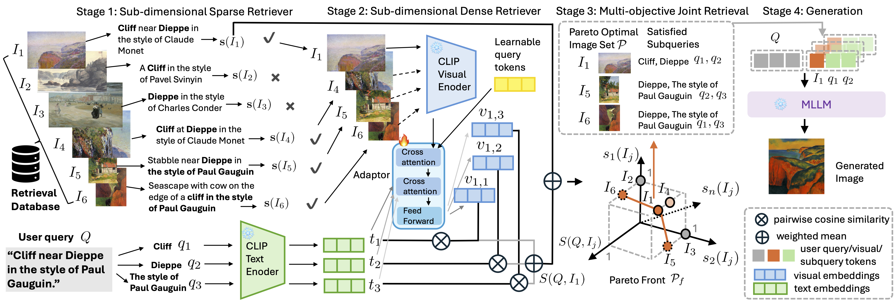

# Cross-modal RAG

This repository provides the official implementation of "Cross-modal RAG: Sub-dimensional Retrieval-Augmented Text-to-Image Generation".

## Framework
The framework of Cross-modal RAG consists of four stages: (1) Sub-dimensional sparse retriever based on lexical match on subqueries; (2) Sub-dimensional dense retriever based on semantic match on sub-dimensional vision embeddings and textual subquery embeddings; (3) Multi-objective joint retrieval to select a set of Pareto-optimal images; and (4) Subquery-aware image generation with retrieved images.

## Release
- [x] Release the code for preprocessing.
Please stay tuned 😉
